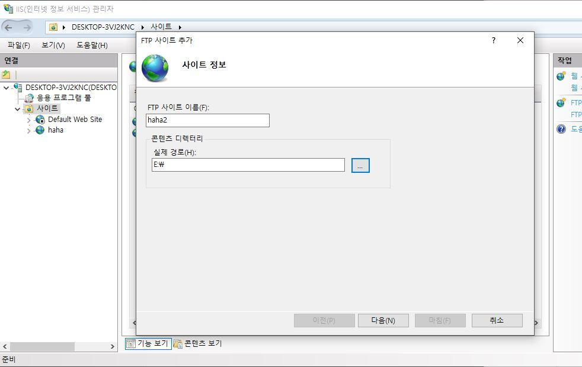
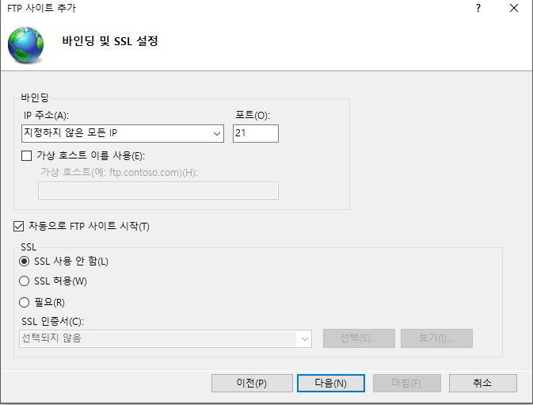
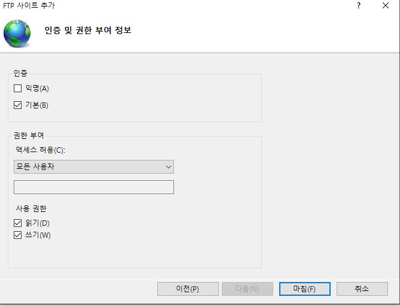
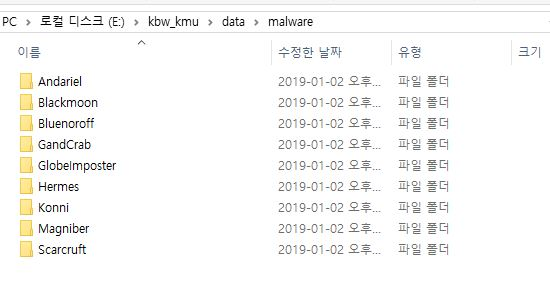

# 인공지능 기술을 이용한 악성코드 분류 기술 개발
---
## 요구사항
- host PC: window10(64bit)
  - python 3.6 (아나콘다 4.5.11 https://www.anaconda.com/download/)
  - scikit learn 0.20.1(명령어: conda install scikit-learn)
  - petest 4.0.1(명령어: pip install pefile)
  - ida pro 7.2
- 동적분석 PC: ubuntu(18.04)
  - cuckoo sandbox(2.0.6)
  - python 2.7

---

##  폴더구조 설명

- code  : 위협그룹 분류, 코드패턴 군집, 유사성 분석 시스템 코드가 저장되어 있는 곳
- cuckoo_code : cuckoo sandbox 설정을 위한 코드가 저장되어 있는 곳
- data
  - attribute : 특징정보가 저장되어 있는 곳
  - bipartite : 이분 그래프가 저장되어 있는 곳
  - cuckoo_report : 동적분석 리포트가 저장되어 있는 곳
  - idb : 정적분석 리포트(idb)가 저장되어 있는 곳
  - malware : 분석할 파일이 저장되어 있는 곳 (악성코드 데이터 입력부분)
  - md5_malware : 32bit pe파일 필터링을 거친 파일이 저장되어 있는 폴더
- ftp : 동적분석 리포트가 임시 저장되어 있는 곳
- similarity_report : 유사성 분석 시스템 리포트가 저장되어 있는 곳

---

## 코드 설명
#####  특징정보 추출 관련 코드
- basic_blockfunction.py : ida-pro에서 기본블록 특징정보와 함수특징 정보를 수집하기 위한 ida-python코드
- make_idb_ops.py : ida-pro를 실행하여 idb파일을 생성하고 ida-python코드를 실행하기 위한 코드
- pe_test.py :  32bit pe파일 필터링과 파일이름을 md5로 바꾸기 위한 코드
- upload.py : 동적분석 요청을 하는 코드
- preprocessing.py : 정적분석과 동적분석 요청을 하는 코드
- preprocessing2.py : 생성된 동적분석 리포트를 그룹별로 정리 하기위한 코드(pe_test.py,upload.py,make_idb_ops.py을 실행한다.)
#####  악성코드간 유사성 분석 시스템 관련 코드
- make_bipartite.py : 이분그래프 최초 생성시 실행되는 코드
- search.py : 유사성 분석, 이분그래프 업데이트를 하는 코드
- smuff.py : 특징정보를 이용하여 유사성 분석하는 코드 (make_bipartite.py,search.py를 실행한다.)

---
## 설치법
##### - 필요한 프로그램 및 패키지를 설치한다.(요구사항 참고)
##### - 최신 업로드된 코드를 다운로드 하고 압축을 푼다.
##### - config.ini 파일을 열어 BASE_DIR_PATH, IDA_PATH, REST_URL의 경로를 설정한다.

1. BASE_DIR_PATH의 경우 kbw_kmu의 경로를 지정해준다.
2. IDA_PATH의 경우 idat.exe(32bit) 경로 또는 idat64.exe(64bit) 경로를 설정해준다.
3. REST_URL의 경우  http://[동적분석 PC의 IP주소]:[동적분석 PC의 REST API 포트번호]/tasks/create/file로 설정해준다.
예) http://203.246.112.135:18090/tasks/create/file

##### - host PC의 컴퓨터의 FTP 다운로드 권한 허용을 시킨다.

예) 해당 소스코드가 경로 E:\kbw_kmu

##### - cuckoo sandbox 옵션 설정

1. /cuckoo/common/config.py 아래 부분에 데이터 추가

        "reporting": {
             "jsondump": {
                "enabled": Boolean(True),
                "indent": Int(4),
                "calls": Boolean(True),
                # append below
                "ftp": Boolean(False)
                "hostname": String(),
                "username": String(),
                "password": String(),
                "destination": String(),
                "port": Int()
            },
            ...

2. 제공한 /cuckoo/reporting/jsondump.py 덮어쓰기

3. /cwd/cuckoo/conf/reporting.conf [jsondump] 옵션 추가

        [jsondump]
        enabled = yes
        indent = 4
        calls = yes
        # fill in the below information
        # ftp = yes / no
        ftp = (yes)
        hostname = host PC의 IP 예)203.246.112.132
        username = host PC의 윈도우 계정이름 예)user
        password = host PC의 윈도우 비밀번호
        destination = /kbw_kmu/data/ftp
        port = host PC의 FTP포트번호(host PC IP가 사설일 경우 포트포워딩 필요)

---
## 사용법
#### 1. 특징정보 추출
- 폴더를 생성하여 특징정보 추출을 원하고자 하는 파일을 폴더에 넣고 폴더에 이름을 붙여준다.

- config.ini를 열어 ATTRIBUTE_LIST를 설정해준다.  
- preprocessing.py를 실행시킨다. (cuckoo sandbox가 동작되있는 상태여야 된다.)

- preprocessing2.py를 실행시킨다. (cuckoo sandbox 동작완료후 실행시켜야 된다.)

#### 2. 악성코드간 유사성 분석 시스템
- 앞서 1.특징정보 추출 과정이 먼저 선행되어야 한다. 아래 그림은 추출과정이 끝난 결과이다.

- smuff.py를 실행시킨다.

- 분류결과 확인.(similarity_report 폴더에서 확인한다.)

- 주요설정
  - 이분그래프(기존 결과물)를 업데이트 시키고 싶을시 UPDATE 변수를 y로 바꾼다.
  - 리포트의 유사도 결과만 보고싶을때에는 VIEW_DETAIL 값을 n으로 바꾼다.
  - 매우 유사한 쌍들의 결과만 보고싶을때에는 MIN_SIMILARITY 값을 높여준다.
  - 악성코드간 유사성 분석 시스템의 분석속도를 빠르게 하고 싶을때에는 MAX_ATTRIBUTE값을 낮춰준다(주의! 유사도 결과에 영향을 미칠수 있다.)

---

## 사용법(case별)

#### 이분그래프를 새로 만들고 싶을때에는
- data/bipartite 경로안에 데이터를 지워준다.
- 1.특징정보 추출 과정을 통하여 특징정보를 생성한다.  (특징정보가 이미 있다면  1.특징정보 추출 과정 생략)
- smuff.py 실행한다.

#### 유사성 분석 시스템 업데이트를 하고 싶을때
- 1.특징정보 추출 과정을 통하여 특징정보를 생성한다.  (특징정보가 이미 있다면  1.특징정보 추출 과정 생략)
- config.ini 에서 UPDATE 값을 y로 변경한다.
- smuff.py 실행한다.

#### 모르는 파일을 유사성 분석을 하고 싶을때
- data/malware 경로에 임의로 폴더를 생성하여 테스트하고 싶은 파일을 넣어준다.
- 테스트시킬 데이터를 1.특징정보 추출을 한다.
- config.ini에서 SEARCH_LABEL_LIST 이름을 data/malware 경로에만들었던 폴더이름으로 입력한다.
- config.ini에서 update를 n으로한다.(y일경우 모르는 파일이 unknown으로 업데이트 된다.)
- smuff.py 실행한다.

___

##  코드관련 파라메터 설명
##### [PARAMETER]
- ATTRIBUTE_LIST = apics,func,block,dom,ip,mut,pdb,str :유사도 분석 및 파일 전처리를 통한 특징정보 추출을 할 경우  추출할 특징정보들을 입력해준다. 특별히 이 설정을 바꿀일은 없다.(입력은 각각의 특징정보에 해당하는 확장자를 입력하고 "," 로 구분된다.)
- MAX_ATTRIBUTE = 10 :유사도 분석을 할 파일들을 필터링 하기 위한 변수(1이상의 정수)  숫자가 낮을수록 필터링이 많이되어 속도가 빨라진다. (유사도 결과에 영향을 줄 수 있어 입력된 데이터가 많을수록 숫자를 크게 잡을 것을 권장한다.)
- MIN_SIMILARITY = 0.001 :출력 될 수 있는 최소 유사도 0 부터 1사이 숫자로 0이면 모든 유사도 분석에 대한 출력이 되고 1이면 유사도가 거의 똑같은 파일들이 출력이된다.
- CPU_COUNT = 1 :멀티 프로세싱으로 이용할 cpu 코어의 개수(1이상의 정수) 특별히 이 설정을 바꿀일은 없다.
- VIEW_DETAIL = y :결과 리포트 특징정보 세부 출력 유무(y 또는 n)
- UPDATE = n :이분 그래프 갱신 유무(y 또는 n)
- SEARCH_LABEL_LIST = :이분그래프 검색 또는 갱신할 레이블 이름(폴더 이름) 공백일시에는 attribute폴더에 있는 모든 레이블에 대하여 적용된다.
- N_GRAM = 8 :API CALL SEQUENCE에서 n-gram시 사용되는 윈도우의 크기(1이상의 정수) 특별히 이 설정을 바꿀일은 없다.

##### [PATH]
- BASE_DIR_PATH = E:/smuff_v3 :위협그룹 분류 시스템의 최상위 폴더
- DATA_PATH = ${BASE_DIR_PATH}/data :SMUFF의 데이터가 저장되어 있는 폴더
- ATTRIBUTE_PATH = ${DATA_PATH}/attribute :특징정보가 저장되어 있는 폴더
- BIPARTITE_GRAPH_PATH = ${BASE_DIR_PATH}/bipartite :이분그래프가 저장되어 있는 폴더
- FILE_SIMILARITY_CSV_PATH = ${BASE_DIR_PATH}/similarity_report :유사도 결과 리포트가 저장되어 있는 폴더
- REPORT_PATH = ${DATA_PATH}/cuckoo_report :동적분석 리포트가 저장되어 있는 폴더
- MALWARE_PATH = ${DATA_PATH}/malware :분석 파일이 저장되어 있는 폴더
- PE32_MALWARE_PATH = ${DATA_PATH}/md5_malware :pe32검사후 파일이 저장되어 있는 폴더
- IDB_PATH = ${DATA_PATH}/idb :idb 파일이 저장되어 있는 폴더
- IDA_SCRIPT_PATH = ${BASE_DIR_PATH}/code/basic_blockfunction.py :ida script가 저장되어 있는 폴더
- FTP_PATH = ${BASE_DIR_PATH}/ftp :동적분석 리포트가 임시로 저장되어있는 폴더

##### [CUCKOO]
- REST_URL = http://203.246.112.135:18090/tasks/create/file :쿠쿠 샌드박스로 리포트 요청하는 주소 http://ip:포트/tasks/create/file

##### [IDA]
- IDA_PATH = C:/Program Files/IDA 7.2/idat.exe :ida pro(CLI)가 설치되어있는 경로

---

##  참고

##### - idb,i64 파일이 제대로 생성되지 않을경우에는 관리자 모드로 실행해보는 것을 권장

##### - 이분 그래프에 갱신할 목적이 없는 파일이라면 사용후 바로 data\attribute 폴더에서 해당파일을 지워주는 것을 권장한다.

- 의도치 않게 이분 그래프에 갱신 될 수 있다.

- 이분 그래프 갱신목적이 아닐경우 중복된 레이블을 사용 안하는 것을 권장한다.(data\attribute에서 특징정보룰 지우기 어렵다.)
